# TOTEM ZMK Config

Personal ZMK configuration for a 38-key [TOTEM](https://github.com/GEIGEIGEIST/TOTEM).

The two halves use Seeed XIAO nRF52840 controllers, with a nice!nano V2 dongle as the split central. The dongle also drives an SH1106 OLED.

## Keymap

Keymap source: [`config/totem.keymap`](config/totem.keymap)

The diagram is generated automatically with [keymap-drawer](https://github.com/caksoylar/keymap-drawer).

## Build

GitHub Actions builds firmware for the left half, right half, and dongle, together with settings-reset images.

Build targets are defined in [`build.yaml`](build.yaml).

## Pairing

If split roles change or old bonding data causes connection problems, flash the appropriate settings-reset image before reflashing the normal firmware.

## Credits

Based on [TOTEM](https://github.com/GEIGEIGEIST/TOTEM) and [ZMK](https://zmk.dev/), with [zmk-dongle-display](https://github.com/englmaxi/zmk-dongle-display).
